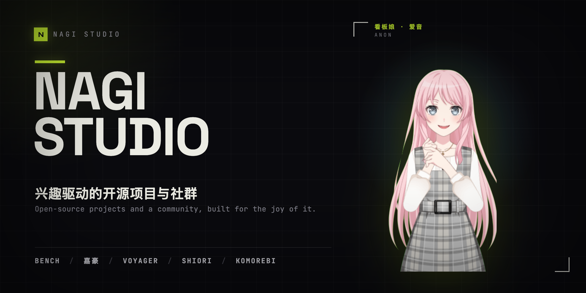
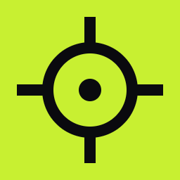

 
 

**[Nagi-ovo](https://github.com/Nagi-ovo) 凭兴趣开源、运营社群的地方 —— 想做就做的项目，加一个聊得来的社群。看板娘是爱音 (Anon)。**

Where [Nagi-ovo](https://github.com/Nagi-ovo) builds open source for the fun of it and runs the community. Mascot: Anon.

 

 

## 项目 · Projects

<table>
<tr>
<td width="60" valign="middle" align="center"></td>
<td valign="middle">
<a href="https://bench.nagi.fun"><b>NAGI BENCH</b></a> &nbsp; <a href="https://github.com/nagi-studio/nagi-bench">repo</a> &nbsp;  
同一段提示词，不同模型，一次生成、不许返工 —— 并排对比可运行作品。 
Same prompt, different models — one shot, no retries. Runnable artifacts side by side.
</td>
</tr>
<tr>
<td width="60" valign="middle" align="center"></td>
<td valign="middle">
<a href="https://jiahao.nagi.fun"><b>AI 嘉豪</b></a> &nbsp; <a href="https://github.com/nagi-studio/ai-jiahao">repo</a> &nbsp;  
开源题库 —— 让模型一起做题，看看谁真的会，看板娘爱音带你测 AI 浓度。 
An open question bank — put the models through the same exam and see who actually knows.
</td>
</tr>
</table>

 

## 个人作品 · Also by [Nagi-ovo](https://github.com/Nagi-ovo)

<table>
<tr>
<td width="60" valign="middle" align="center"></td>
<td valign="middle">
<a href="https://voyager.nagi.fun"><b>Voyager</b></a> &nbsp; <a href="https://github.com/Nagi-ovo/gemini-voyager">repo</a> &nbsp;  
Gemini &amp; AI Studio 全能增强插件：时间轴导航、文件夹管理、提示词库、对话导出。 
An all-in-one enhancement suite for Google Gemini &amp; AI Studio — timeline, folders, prompt library, export.
</td>
</tr>
<tr>
<td width="60" valign="middle" align="center"></td>
<td valign="middle">
<a href="https://shiori.nagi.fun"><b>Shiori 栞</b></a> &nbsp; <a href="https://github.com/Nagi-ovo/shiori-releases">repo</a> &nbsp;  
本地优先的 PDF 编辑器，也是 PDF / HTML / Markdown 的全平台阅读器（含手机）。 
A local-first PDF editor — and a cross-platform reader for PDF, HTML &amp; Markdown (mobile too).
</td>
</tr>
<tr>
<td width="60" valign="middle" align="center"></td>
<td valign="middle">
<a href="https://github.com/Nagi-ovo/komorebi"><b>Komorebi 木漏れ日</b></a> &nbsp;  
给网页的静谧主题 —— GitHub / Google / X，Everforest 配色，明暗双色，配套浏览器主题。 
A calm theme for the web — GitHub, Google &amp; X in the Everforest palette, light &amp; dark, with matching browser themes.
</td>
</tr>
</table>

 

Built by <a href="https://github.com/Nagi-ovo">Nagi-ovo</a> · 看板娘 爱音 Anon

